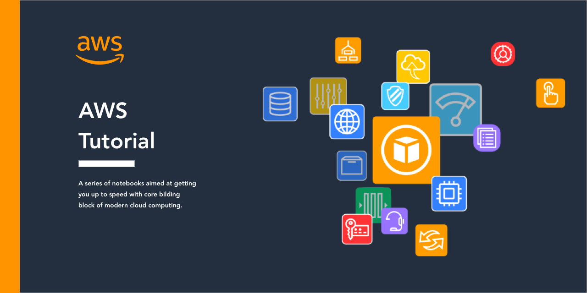

# **AWS Tutorials**
An overview and how to on some of the most popular cloud computing services availble. Use them by themseleves or part of a larger system. They take care of most of the hard stuff.

## **Getting Started**

#### **1. Install Anaconda**

#### **2. Clone this Repo**

#### **3. Install Dependencies**

#### **4. Set AWS Vars and Kernel**

#### **5. Launch Jupyter Lab**
```bash
# Adds the enviornment to your jupyter notebook
python -m ipykernel install --name aws-tut
```
